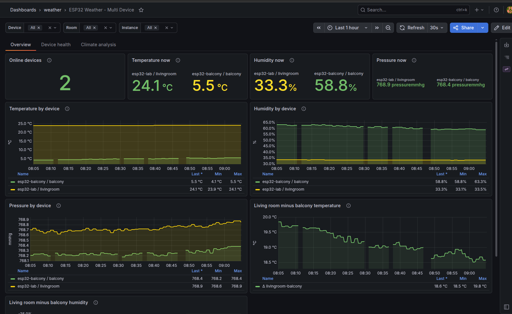
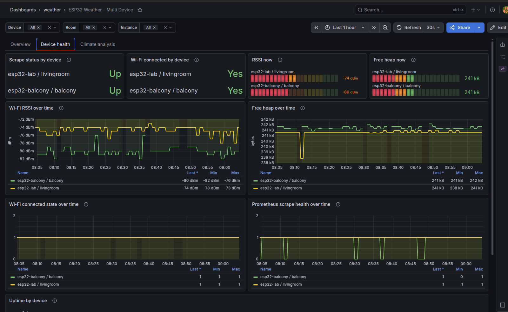
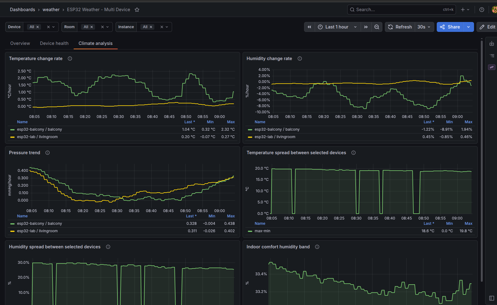
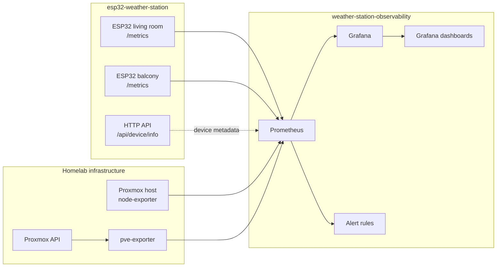

# Weather Station Observability

Observability stack for the [ESP32 Weather Station](https://github.com/azargarov/esp32-weather-station) project.

This repository contains the Prometheus and Grafana side of the system: scrape configuration, dashboards, alert rules, Proxmox exporter configuration, and local templating for environment-specific settings.

The sensor firmware lives in the companion repository: [`esp32-weather-station`](https://github.com/azargarov/esp32-weather-station).

## Project relationship

This repository is the observability part of the larger **ESP32 Weather Station** project.

The full project is split into two repositories:

| Repository | Purpose |
|---|---|
| [`esp32-weather-station`](https://github.com/azargarov/esp32-weather-station) | ESP32 firmware, sensor handling, HTTP API, device identity, and Prometheus `/metrics` endpoint |
| [`weather-station-observability`](https://github.com/azargarov/weather-station-observability) | Prometheus, Grafana, dashboards, alert rules, Proxmox metrics, and runtime configuration |

Together they form one product: an ESP32-based weather station with a local observability stack for collecting, visualizing, and analyzing environmental sensor data.

## Screenshots

### Overview



### Device health



### Climate analysis



## What this project monitors

The current dashboard is built around multiple ESP32 devices, for example a living room sensor and a balcony sensor. The stack can monitor:

- Temperature, humidity, and pressure by device and room
- Indoor/outdoor deltas, such as living room minus balcony temperature
- Device availability through Prometheus scrape status
- Wi-Fi connection state and RSSI
- ESP32 free heap and uptime
- Proxmox host and API metrics through exporters

## Architecture



## Features

- Docker Compose based observability stack
- Prometheus configuration with file-based service discovery
- Grafana dashboards provisioned from files
- Multi-device ESP32 dashboard using `device`, `room`, and `instance` labels
- Device-health view for scrape status, Wi-Fi state, RSSI, heap, and uptime
- Climate-analysis view for change rates, pressure trends, humidity trends, and sensor deltas
- Proxmox monitoring through node exporter and `prometheus-pve-exporter`
- Local templating workflow using `.env`, `secrets/`, and generated config files
- Makefile targets for rendering, validation, startup, logs, reload, and cleanup

## Repository layout

```text
.
├── docker-compose.yaml              # Prometheus, Grafana, pve-exporter
├── Makefile                         # Main operator workflow
├── .env.example                     # Safe example configuration
├── grafana/
│   ├── dashboards/                  # Dashboard JSON files
│   └── provisioning/                # Grafana datasource/dashboard provisioning
├── prometheus/
│   ├── prometheus.yml               # Prometheus base configuration
│   └── rules/                       # Alert rules
├── scripts/
│   └── render-config.sh             # Renders local runtime config
├── templates/
│   └── prometheus/                  # Templates for targets and pve.yml
├── generated/                       # Local generated files, ignored by Git
└── secrets/                         # Local secrets, ignored by Git
```

## Requirements

- Docker
- Docker Compose
- `make`
- `envsubst`, usually provided by the `gettext` package
- One or more ESP32 devices exposing Prometheus metrics on `/metrics`
- Optional: Proxmox host with node exporter and a Proxmox API token for `pve-exporter`

On openSUSE, the basic tools can be installed with:

```bash
sudo zypper install make gettext-runtime
```

## Quick start

Clone the repository:

```bash
git clone https://github.com/azargarov/weather-station-observability.git
cd weather-station-observability
```

Create local configuration files:

```bash
make init
```

Edit `.env` and adjust device names, rooms, target addresses, and Proxmox settings:

```bash
vim .env
```

Put the real Proxmox API token value into the local secret file:

```bash
printf '%s\n' 'YOUR_REAL_PVE_TOKEN_VALUE' > secrets/pve_token_value
chmod 600 secrets/pve_token_value
```

Render runtime configuration:

```bash
make render
```

Validate Prometheus configuration and rules:

```bash
make check
```

Start the stack:

```bash
make up
```

Open the services:

```text
Grafana:    http://localhost:3000
Prometheus: http://localhost:9090
```

For a local lab, Grafana is configured with the default credentials from `docker-compose.yaml`:

```text
admin / admin
```

Change them before exposing Grafana outside a trusted local environment.

## Configuration model

The repository is designed so real local values do not need to be committed.

Committed files:

```text
.env.example
templates/
prometheus/
grafana/
scripts/
Makefile
docker-compose.yaml
```

Local-only files:

```text
.env
secrets/
generated/
```

The workflow is:

```text
.env + secrets/ + templates/ -> scripts/render-config.sh -> generated/
```

Prometheus and `pve-exporter` then consume files from `generated/`.

## Example `.env`

```env
ENV_NAME=homelab

PROMETHEUS_URL=http://prometheus:9090

PROXMOX_NODE_EXPORTER_TARGET=192.168.1.99:9100
PROXMOX_API_TARGET=192.168.1.99
PROXMOX_HOST_LABEL=proxmox

ESP32_LIVINGROOM_TARGET=livingroom-sensor.local
ESP32_LIVINGROOM_DEVICE=esp32-lab
ESP32_LIVINGROOM_ROOM=livingroom

ESP32_BALCONY_TARGET=balcony-sensor.local
ESP32_BALCONY_DEVICE=esp32-balcony
ESP32_BALCONY_ROOM=balcony

PVE_USER=prometheus@pve
PVE_TOKEN_NAME=pve-exporter-token
PVE_VERIFY_SSL=false
```

## Useful commands

```bash
make help                # Show available targets
make init                # Create .env and local secret placeholder
make render              # Generate runtime configs
make check               # Validate Prometheus config and rules
make up                  # Render, validate, and start the stack
make down                # Stop the stack
make restart             # Restart the stack
make logs                # Follow all logs
make logs-prometheus     # Follow Prometheus logs
make logs-grafana        # Follow Grafana logs
make reload-prometheus   # Reload Prometheus through /-/reload
make targets             # Print Prometheus targets URL
make secret-scan         # Search tracked files for obvious secrets
make clean               # Stop stack and remove volumes
```

## ESP32 metrics endpoint

Each ESP32 device should expose Prometheus-compatible metrics on `/metrics`.

Example target configuration is generated from templates into:

```text
generated/prometheus/targets/esp32.yml
```

The labels make the dashboard reusable across devices:

```yaml
labels:
  env: homelab
  device: esp32-lab
  room: livingroom
```

The dashboard uses these labels for filtering and grouping.

## Proxmox metrics

This stack supports two Proxmox-related scrape paths:

1. `node-exporter` on the Proxmox host for host-level Linux metrics
2. `prometheus-pve-exporter` for Proxmox API metrics

The Proxmox API token is stored locally in:

```text
secrets/pve_token_value
```

The generated exporter config is written to:

```text
generated/prometheus/pve.yml
```

This file should never be committed.

## Troubleshooting

Check running containers:

```bash
docker compose ps
```

Check generated Prometheus configuration:

```bash
make check-config
```

Check Prometheus logs:

```bash
make logs-prometheus
```

Check Grafana logs:

```bash
make logs-grafana
```

Check whether Prometheus can resolve the Proxmox exporter service name:

```bash
docker compose exec prometheus getent hosts pve-exporter
```

Test the Proxmox exporter endpoint from inside the Prometheus container:

```bash
docker compose exec prometheus wget -qO- \
  'http://pve-exporter:9221/pve?target=192.168.1.99&module=default&cluster=1&node=1'
```

If ESP32 targets use `.local` names and Prometheus cannot scrape them from Docker, use static IP addresses in `.env` or configure DNS/mDNS resolution for the Docker host.


## Future ideas

- Add Alertmanager
- Add long-term Prometheus retention tuning
- Add calibration metadata for ESP32 sensors
- Add daily, weekly, monthly, and yearly climate summaries
- Add Loki for ESP32 or infrastructure logs
- Add external weather API comparison
- Add Grafana annotations for sensor maintenance or calibration events

