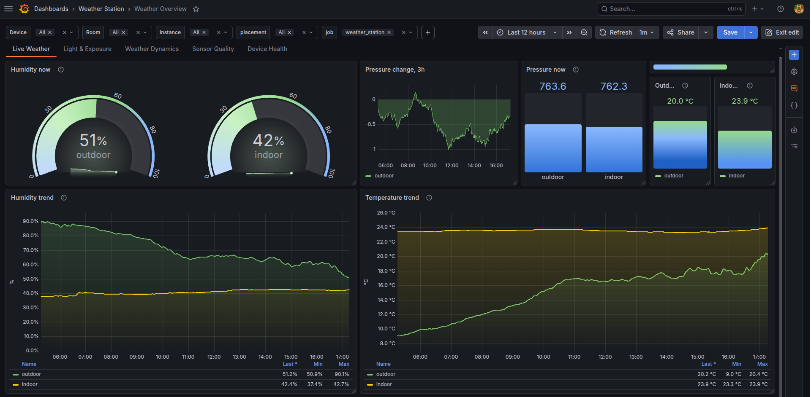
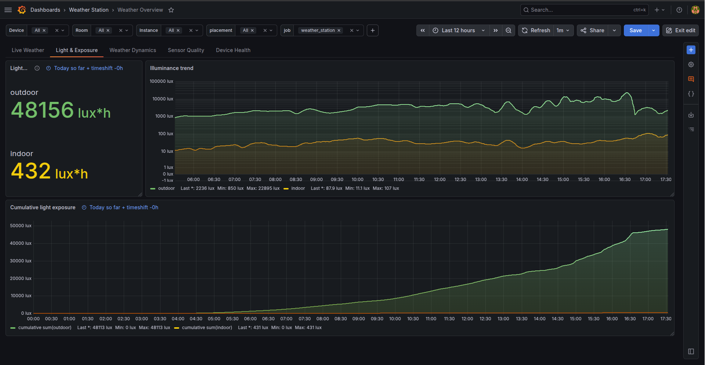
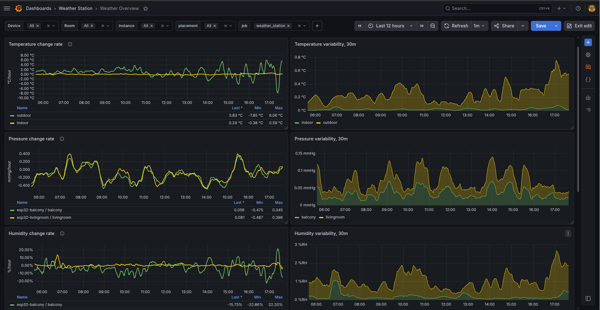
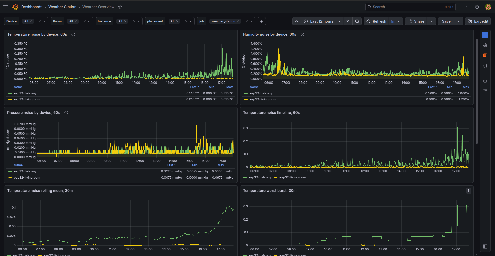
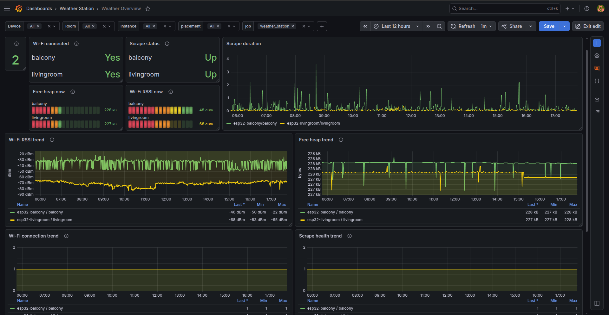
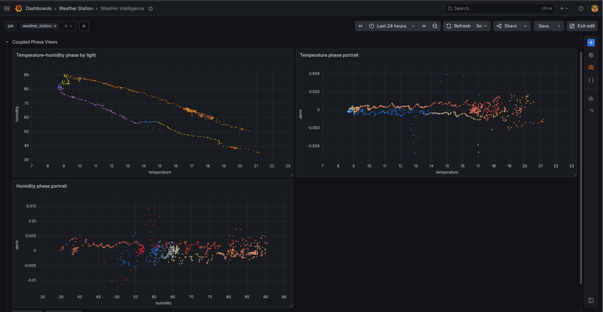
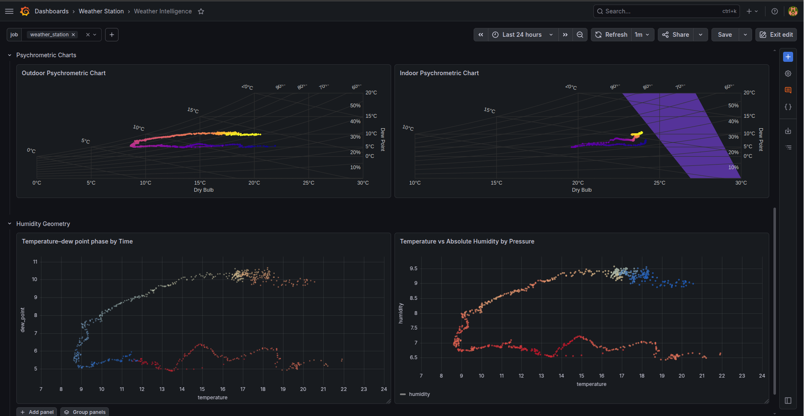

# Grafana Dashboard Gallery

## Live Weather

Shows current indoor/outdoor temperature, humidity, pressure, and basic trends.

## Light & Exposure

Tracks illuminance and cumulative daily light exposure.

## Weather Dynamics

Shows rate of change and short-term variability.

## Sensor Quality

Shows sensor noise, rolling standard deviation, and worst bursts.

## Device Health

Shows Wi-Fi status, scrape health, RSSI, heap, and scrape duration.

## Phase Analysis

Explores relationships such as temperature vs dew point, humidity vs temperature, and derivative-based phase portraits.

## AirState & Phychrometrics

Radar-style daily summaries for min/mean/median/max values.

